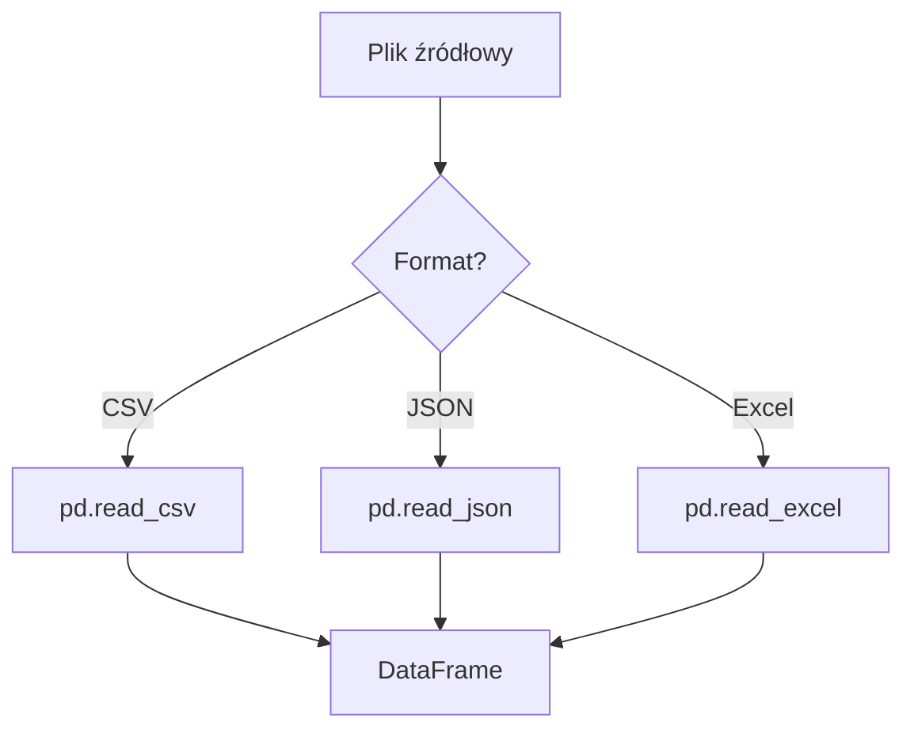

# Wykład 2: Pozyskiwanie danych

## 1. Źródła danych

Dane mogą pochodzić z różnych źródeł:
- **Lokalne pliki**: CSV, Excel, JSON, Parquet.
- **Bazy danych**: SQL (PostgreSQL, MySQL), NoSQL (MongoDB).
- **API**: Serwisy RESTful zwracające najczęściej JSON.
- **Web Scraping**: Wyciąganie danych bezpośrednio ze stron HTML.

## 2. Praca z plikami tekstowymi i binarnymi

Najpopularniejszym formatem w data science jest **CSV** (Comma Separated Values) ze względu na prostotę.

### Przykład wczytywania różnych formatów (koncepcyjnie):


## 3. Web Scraping - Automatyczne pobieranie danych

Web Scraping to technika pobierania danych ze stron WWW przy pomocy kodu.

### Narzędzia:
- **Requests**: Do wysyłania zapytań HTTP (pobieranie treści strony).
- **BeautifulSoup**: Do parsowania (przeszukiwania) kodu HTML.

### Przykład praktyczny (BeautifulSoup):
```python
import requests
from bs4 import BeautifulSoup

url = "https://example.com"
response = requests.get(url)
soup = BeautifulSoup(response.text, 'html.parser')

# Znalezienie wszystkich nagłówków h1
naglowki = soup.find_all('h1')
for n in naglowki:
    print(n.text)
```

## 4. Dobre praktyki i aspekty prawne
- **robots.txt**: Sprawdzaj, czy strona zezwala na scraping.
- **User-Agent**: Przedstawiaj się serwerowi.
- **Rate limiting**: Nie przeciążaj serwerów (używaj `time.sleep`).

## 5. Podsumowanie
Pozyskanie danych to pierwszy techniczny krok w analizie. Wybór metody zależy od dostępności danych i ich struktury. Na laboratorium nauczymy się pobierać dane ze stron internetowych oraz wczytywać pliki CSV i Excel.
