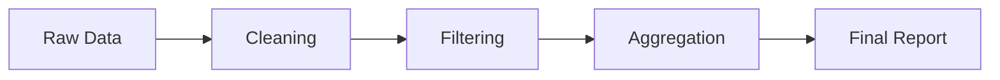

# Wykład 3: Przetwarzanie danych z Pandas

## 1. Biblioteka Pandas

Pandas to najważniejsza biblioteka do obróbki danych w Pythonie. Wprowadza dwa kluczowe obiekty:
- **Series**: Jednowymiarowa tablica (jak kolumna w Excelu).
- **DataFrame**: Dwuwymiarowa struktura danych (jak cała tabela/arkusz).

## 2. Eksploracyjna Analiza Danych (EDA)

Zanim zaczniemy wyciągać wnioski, musimy zrozumieć nasze dane.
Podstawowe operacje:
- `df.head()` - pierwsze wiersze.
- `df.info()` - typy danych i braki.
- `df.describe()` - statystyki opisowe (średnia, mediana, min/max).

## 3. Czyszczenie danych

Dane w rzeczywistym świecie są "brudne".
Typowe problemy:
1. **Braki danych (NaN)**: Możemy je usunąć (`dropna()`) lub uzupełnić (`fillna()`).
2. **Duplikaty**: Usuwamy za pomocą `drop_duplicates()`.
3. **Błędne typy**: Np. data zapisana jako tekst – konwertujemy za pomocą `pd.to_datetime()`.

## 4. Transformacje i Agregacje

Pandas pozwala na potężne operacje na grupach danych:
- **Filtering**: Wybieranie wierszy spełniających warunek, np. `df[df['wiek'] > 18]`.
- **Grouping**: Grupowanie danych, np. `df.groupby('kategoria')['cena'].mean()`.

### Proces transformacji:

## 5. Podsumowanie
Pandas pozwala zamienić surowe dane w uporządkowaną informację. Na laboratorium przećwiczymy wczytywanie dużych zbiorów danych, ich czyszczenie oraz zaawansowane filtrowanie i grupowanie.
