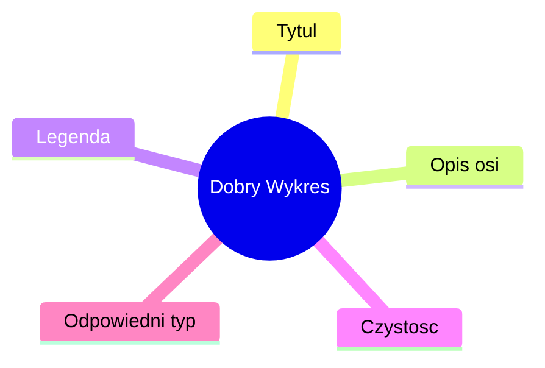

# Wykład 4: Wizualizacja danych i komunikacja wyników

## 1. Dlaczego wizualizujemy dane?

Ludzki mózg znacznie szybciej przetwarza informacje wizualne niż liczby w tabeli. Wizualizacja pomaga:
- Wykryć trendy i wzorce.
- Zidentyfikować wartości odstające (outliers).
- Przekazać skomplikowane wnioski w przystępny sposób.

## 2. Rodzaje wykresów i ich zastosowanie

| Typ wykresu | Zastosowanie |
| :--- | :--- |
| **Liniowy** | Trendy w czasie |
| **Słupkowy** | Porównania kategorii |
| **Histogram** | Rozkład zmiennej |
| **Punktowy (Scatter)** | Zależności między dwiema zmiennymi |
| **Pudełkowy (Boxplot)** | Statystyki i wartości odstające |

## 3. Ekosystem wizualizacji w Pythonie

### Matplotlib
Najstarsza i najbardziej elastyczna biblioteka. Daje pełną kontrolę nad każdym elementem wykresu.
```python
import matplotlib.pyplot as plt

plt.plot([1, 2, 3], [4, 5, 1])
plt.title("Prosty wykres")
plt.show()
```

### Seaborn
Zbudowana na bazie Matplotlib. Oferuje piękniejsze style i upraszcza tworzenie skomplikowanych wykresów statystycznych.

## 4. Zasady tworzenia dobrych wykresów
1. **Opisy**: Zawsze dodawaj tytuł i opisy osi.
2. **Prostota**: Unikaj zbędnych ozdobników (chart junk).
3. **Kolory**: Używaj ich celowo, uważaj na osoby nieodróżniające barw.



## 5. Podsumowanie
Wizualizacja to ostatni, ale kluczowy etap analizy. Nawet najlepsza analiza nie przyniesie efektu, jeśli nie zostanie dobrze zaprezentowana. Na ostatnim laboratorium nauczymy się tworzyć profesjonalne wykresy i łączyć je z danymi z Pandas.
